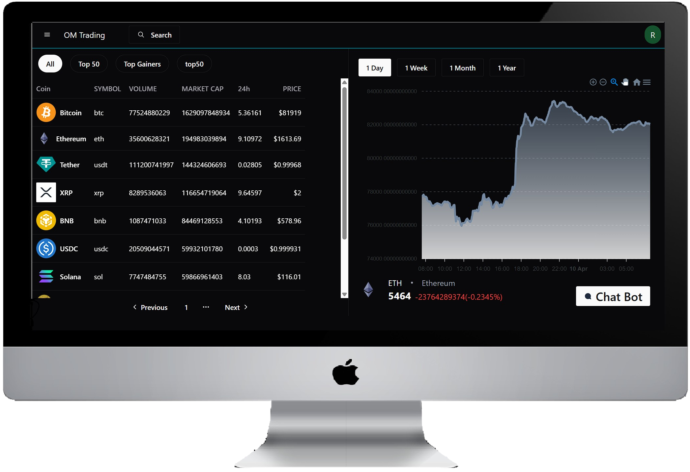

# 🚀 Crypto Trading Platform

A powerful and modern crypto trading platform built with **Spring Boot** and **React**, offering real-time market data, seamless buy/sell functionality, intelligent AI chatbot support, advanced wallet operations, and robust security — all designed for the next-gen crypto experience.

---

## 📸 Screenshots

  

## 🌟 Features

### 🧠 AI Chat Bot
- Get real-time crypto-related answers using AI.
- Powered by **Gemini API** and **CoinGecko API** for live price and market data.

### 💱 Buy & Sell Crypto
- User-friendly interface for buying and selling multiple cryptocurrencies.
- Real-time pricing and execution.

### 📊 Portfolio Management
- Track your investments and monitor performance with a clean, intuitive dashboard.

---

## 🔐 Advanced Wallet Functionality
- **Wallet to Wallet Transfer**: Instantly send crypto to other wallets securely.
- **Withdrawal to Bank Account**: Convert crypto to fiat and transfer to bank accounts.
- **Add Balance**: Top up your wallet anytime, anywhere.

---

## 📜 Transaction History
- **Withdrawal History**: Review your past withdrawals with timestamps and statuses.
- **Wallet History**: Full log of all wallet-related transactions.
- **Search Coin**: Search and view data for any cryptocurrency for smarter trading.

---

## 🔒 Authentication & Security
- **Login & Register**: Secure user sign-up and sign-in system.
- **Two-Factor Authentication (2FA)**: Added protection for your account.
- **Forgot Password**: Reset your password securely and easily.

---

## 🛠️ Tech Stack

### 🔧 Backend
- **Spring Boot**
- **MySQL**
- **Spring Security**
- **Java Mail Sender**

### 🎨 Frontend
- **React.js**
- **Tailwind CSS**
- **Redux**
- **Axios**
- **React-Router-Dom**
- **Shadcn UI**

### 💳 Payment Gateways
- **Razorpay**
- **Stripe**

### 🔌 APIs
- **Gemini API**
- **CoinGecko API**

---

## 🔗 Connect with Me
### Om Prakash Sao
- **Final Year B.Tech CSE | Full Stack Java Developer**
- **📧 saoomprakash2002@gmail.com**
- **🌐 https://www.linkedin.com/in/om-prakash-sao-6bb039240/**

